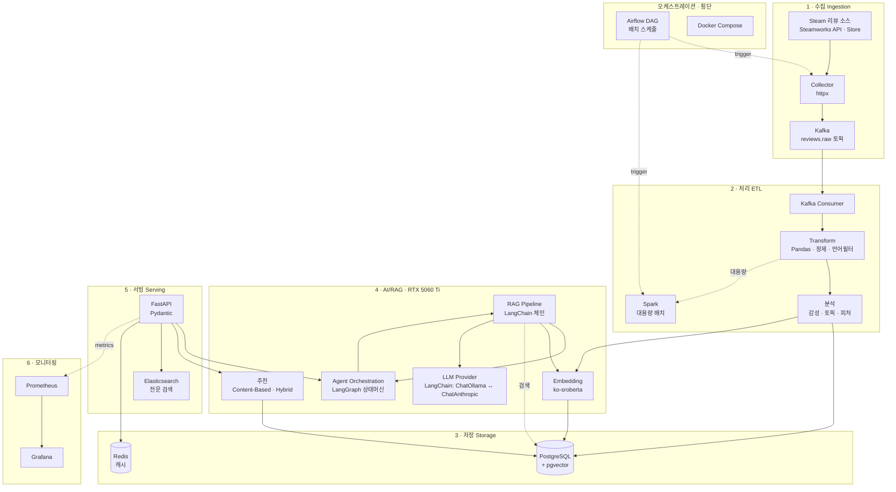
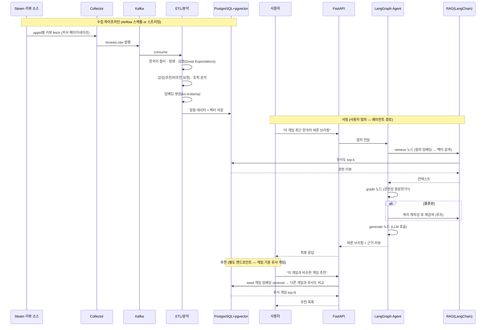
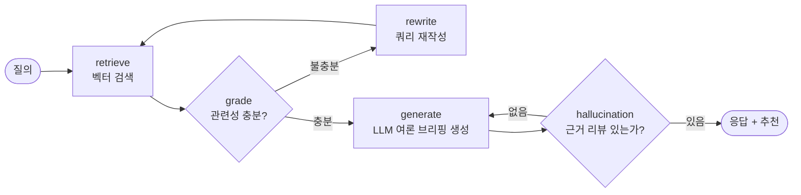

# 한국어 스팀 리뷰 분석 + RAG 브리핑 플랫폼 — 아키텍처 설계서

> **한 줄 정의**: Steam 게임 리뷰(한국어)를 수집하여 감성·토픽 분석과 임베딩을 수행하고, RAG 기반 게임 여론 브리핑과 유사 리뷰/게임 추천을 제공하는 통합 데이터·AI 플랫폼.
>
> - **RAG** (Retrieval-Augmented Generation = 검색 증강 생성): LLM이 그냥 답하는 게 아니라, 먼저 관련 문서를 **검색**해서 그 내용을 근거로 답을 **생성**하는 방식. "아는 척"이 아니라 "찾아보고 답하기".
> - **임베딩** (embedding): 문장을 숫자 벡터로 바꾼 것. 뜻이 비슷한 문장은 벡터도 가까워져서, 유사한 리뷰 검색이 가능해진다.
> - **LLM** (Large Language Model = 대규모 언어 모델): ChatGPT·Claude·qwen 같은, 글을 이해하고 생성하는 AI 모델.

이 문서는 **구현 전 확정하는 청사진**입니다. 모든 소스 코드는 이 문서를 기준으로 작성됩니다.

---

## 0. 설계 4원칙 (모든 결정의 기준)

이 프로젝트의 모든 코드는 아래 네 원칙을 따릅니다. 면접에서 "왜 이렇게 짰나요?"에 대한 답이 전부 여기서 나옵니다.

1. **교체 가능성 (Swappability = 갈아끼우기 쉬움)** — 저장소·LLM·수집기는 전부 인터페이스 뒤에 숨긴다. 환경변수 하나로 로컬 ↔ 클라우드, Ollama ↔ Claude 를 갈아끼운다.
2. **계층 격리 (Layered Isolation = 층 나눠 분리)** — 상위 계층은 하위 계층의 *추상*(구체 구현이 아니라 "이런 기능이 있다"는 약속)에만 의존한다. 도메인 로직은 FastAPI도 PostgreSQL도 모른다.
3. **항상 동작 (Always Runnable = 언제나 실행됨)** — 매 개발 단계 끝에 `docker compose up`(컨테이너 전체를 한 번에 띄우는 명령) 하면 전체가 돈다. 반쯤 만든 채로 다음으로 넘어가지 않는다.
4. **라이브러리 우선 (Library-First = 바퀴를 다시 만들지 않기)** — 이미 검증된 라이브러리가 하는 일을 손으로 다시 구현하지 않는다. HTTP 호출·RAG 조립·평가지표·데이터 분할 같은 표준 작업은 LangChain·scikit-learn 같은 기성 도구로 처리한다. **이 프로젝트의 학습 목표는 "밑바닥부터 재발명"이 아니라 "라이브러리를 제대로 쓰는 법을 익히며 소스를 채우는 것"이다.** 단, 라이브러리를 쓰더라도 원칙 1·2를 위해 얇은 도메인 인터페이스 뒤에 감싼다 (예: LangChain의 `ChatOllama`를 `LLMProvider` 구현체 안에서 쓴다).

> **인터페이스**(interface)란? "무엇을 할 수 있는지"만 정해둔 약속(예: "저장소는 `save()`와 `get()`을 가진다"). 실제로 어떻게 하는지(=구현)는 뒤에 숨긴다. 그래서 구현을 통째로 바꿔도 약속만 지키면 나머지 코드는 그대로 돌아간다.

---

## 1. 개발 환경 & 로컬 하드웨어 & AI 모델 선정

### 개발 환경 (확정)

| 항목 | 값 | 비고 |
|---|---|---|
| **OS** | Windows 11 | Docker Desktop + WSL2 백엔드 사용 |
| **GPU** | RTX 5060 Ti 16GB (GDDR7, ~15.5GB 가용) | Blackwell, CUDA 12.8 |
| **에디터** | VSCode | 확장·워크스페이스 설정은 아래 |
| **패키지 매니저** | **pip + venv** | 파이썬 표준 도구. 의존성은 `requirements.txt`로 관리 |
| **파이썬** | 3.13 | `python -m venv .venv` 로 가상환경 생성 |

> **Windows에서의 실행 전략**: 애플리케이션 코드는 Windows 네이티브(VSCode + venv)에서 개발하되, **인프라(Postgres·Kafka 등)는 Docker Desktop(WSL2 백엔드) 컨테이너**로 띄웁니다. **Ollama는 Windows 네이티브 설치**를 권장합니다 — RTX 5060 Ti의 CUDA 가속을 WSL2 GPU 패스스루보다 안정적으로 받습니다. 즉 `ollama serve`는 호스트에서 돌고, 컨테이너/코드는 `host.docker.internal:11434` 로 접속합니다.

#### VSCode 권장 확장 & 워크스페이스 설정
필수 확장: `ms-python.python`, `charliermarsh.ruff`(Ruff 공식), `ms-azuretools.vscode-docker`, `ms-python.mypy-type-checker`, `redhat.vscode-yaml`. `.vscode/settings.json` 에 venv 인터프리터(`.venv/Scripts/python.exe` — Windows는 `bin`이 아니라 **`Scripts`**), 저장 시 Ruff 포맷·임포트 정리를 걸어둡니다. 이 파일들은 Slice 0에서 생성합니다.

### 로컬 하드웨어 & AI 모델 (RTX 5060 Ti 16GB 기준)

이 프로젝트의 AI 모델은 **로컬 GPU: RTX 5060 Ti 16GB (GDDR7, 약 15.5GB 사용 가능)** 를 기준으로 선정합니다. 클라우드로 갈아끼울 수 있게 추상화하되, 기본값은 로컬에서 무료로 돌아가야 합니다.

### 왜 이 하드웨어가 기준인가
16GB VRAM은 **14B 모델을 Q4 양자화로, 8B 모델을 Q8로** 돌리기에 딱 맞는 지점입니다. 30B 이상은 이 카드에서 무리이고, 7B 이하만 쓰면 품질이 아쉽습니다. 즉 이 프로젝트는 "14B Q4가 최대 상한"이라는 제약 안에서 모델을 고릅니다.

> **용어 풀이**
> - **VRAM** (Video RAM = 그래픽카드 전용 메모리): GPU가 모델을 올려두고 계산하는 작업 공간. 모델이 이 용량을 넘으면 안 돌아간다.
> - **B** (Billion = 10억): 모델 크기 단위. "14B"는 파라미터(모델 내부 가중치)가 140억 개라는 뜻. 클수록 똑똑하지만 VRAM을 더 먹는다.
> - **양자화** (quantization): 모델 숫자의 정밀도를 낮춰 용량을 줄이는 기법. **Q4**(4비트)는 많이 줄여 가볍고, **Q8**(8비트)은 덜 줄여 품질이 더 좋다. `Q4_K_M`의 `K_M`은 그중에서도 품질·크기 균형이 좋은 방식이라는 이름표.

### 모델 선정표

| 용도 | 선정 모델 | 양자화 | VRAM 점유 | 선정 이유 |
|---|---|---|---|---|
| **LLM (RAG 생성)** | `qwen3:14b` | Q4_K_M | ~8.5GB | 다국어(한국어 포함) 강함. 14B가 이 카드 상한. 컨텍스트 여유 남음 |
| **LLM (경량/에이전트)** | `qwen3:8b` | Q4_K_M | ~5GB | 툴 콜링·에이전트에 적합. 빠른 응답. 여유롭게 적재 |
| **임베딩 (한국어)** | `jhgan/ko-sroberta-multitask` | FP16 | ~0.5GB | 한국어 문장 임베딩 특화. 리뷰처럼 짧은 구어체 문장에 강함. CPU/GPU 모두 가능 |
| **폴백 (외부 API)** | `claude-sonnet-4-6` | — | 0 (원격) | 품질 최우선일 때. 환경변수로 전환 |

> **VRAM 예산**: LLM 14B Q4(~8.5GB) + 임베딩(~0.5GB) + KV 캐시/컨텍스트(~3GB) ≈ 12GB. 15.5GB 안에 여유롭게 들어갑니다. 임베딩은 배치 처리 시에만 GPU를 쓰고 평소엔 내려서 LLM에 VRAM을 몰아줄 수도 있습니다.

> **리뷰 데이터 특성 참고**: 스팀 리뷰는 뉴스 기사보다 **짧고 구어체·은어·오타가 많으며**, "추천/비추천" 라벨과 플레이타임이라는 정형 메타데이터가 이미 붙어 있습니다. 임베딩·감성 모델 선정 시 이 점을 고려합니다 (§3, §8).

### 운영 팁 (코드에 반영)
- **Ollama는 Windows 네이티브 설치** (installer 또는 `winget install Ollama.Ollama`). NVIDIA 드라이버 570+ 에서 Blackwell(50-시리즈) CUDA 12.8 가속이 켜집니다. `ollama run qwen3:14b --verbose` 로그에 "loaded on GPU" 확인.
- **컨테이너에서 호스트 Ollama 접속**: `.env`의 `LLM_BASE_URL=http://host.docker.internal:11434`. WSL2 GPU 패스스루로 Ollama를 컨테이너에 넣는 것보다 네이티브가 드라이버 호환·성능 면에서 안정적입니다.
- 컨텍스트 기본값은 2048 토큰. RAG는 검색 리뷰를 많이 넣으므로 `num_ctx=8192` 이상으로 올립니다 (`.env`의 `LLM_NUM_CTX`).
- 모델 교체가 잦으면 NVMe SSD 권장 — 15GB Q4 모델 로딩이 SATA 10초+ vs NVMe 2초.
- **Windows 파일 성능**: 코드 리포지토리는 Windows 파일시스템(`C:\...`)에 두고 VSCode로 직접 엽니다. 단, 대용량 Docker 볼륨 I/O가 필요한 작업은 WSL2 파일시스템이 더 빠르니 상황에 따라 선택합니다.

---

## 2. 전체 아키텍처 (Layered)



> **위 그림에 나온 도구 용어 풀이** (처음 보는 이름들):
> - **ETL** (Extract-Transform-Load = 추출·변환·적재): 데이터를 가져와(추출) 다듬고(변환) 저장(적재)하는 3단계 데이터 처리 흐름.
> - **Kafka**: 데이터를 "토픽"이라는 통로로 흘려보내는 메시지 큐. 수집과 처리를 느슨하게 이어준다(한쪽이 밀려도 다른 쪽은 자기 속도로 처리).
> - **Spark**: 데이터가 아주 많을 때 여러 대로 나눠 처리하는 대용량 배치 엔진.
> - **pgvector**: PostgreSQL이 벡터(임베딩)를 저장하고 유사도 검색을 하게 해주는 확장 기능.
> - **Redis**: 자주 쓰는 결과를 잠깐 메모리에 저장해 두는 캐시(다음에 빠르게 재사용).
> - **Elasticsearch** (ES): 키워드로 문서를 빠르게 찾는 전문 검색 엔진.
> - **Prometheus / Grafana**: 각각 지표 수집 / 지표 그래프 대시보드. 시스템이 잘 돌고 있는지 눈으로 본다.
> - **Airflow**: "매일 새 리뷰 수집" 같은 작업을 정해진 시각에 자동 실행하는 스케줄러. DAG(Directed Acyclic Graph = 방향 있는 비순환 그래프)로 작업 순서를 그린다.

> **LangChain vs LangGraph 역할 분리** (2025.10 v1.0 기준 공식 분리):
> - **LangChain** = 에이전트 프레임워크. 모델·도구·검색기(retriever = 관련 문서를 찾아오는 부품) 추상과 통합. 한 번 검색→증강→생성하는 RAG는 여기서 처리.
> - **LangGraph** = 오케스트레이션(orchestration = 여러 단계를 지휘·조율) 런타임. 상태머신·조건 분기·재시도·human-in-the-loop(사람이 중간에 개입)·영속성. 도구를 부르고 결과를 평가해 다음 행동을 결정하는 **반복형 에이전트**는 여기서 처리.
>
> 이 프로젝트는 단순 브리핑(LangChain)과 다단계 에이전트(LangGraph)를 **둘 다** 씁니다. 상세는 §5.

---

## 3. 데이터 흐름 (End-to-End)



> **한국어 필터링이 왜 별도 단계인가**: 스팀 리뷰는 한 게임에 수십 개 언어가 섞여 들어옵니다. 수집 시 Steamworks API의 `language=koreana` 파라미터로 1차 필터하고, ETL에서 `langdetect`로 2차 검증합니다 (API 라벨이 항상 정확하진 않음).

---

## 4. 디렉토리 구조 (Clean Architecture)

```
korean-steam-review-rag/
├── docker-compose.yml          # 전체 스택 오케스트레이션 (Postgres·Redis·Kafka 등)
├── docker-compose.override.yml # 로컬 개발용 오버라이드
├── .env.example                # 환경변수 템플릿 (교체 지점 전부)
├── pyproject.toml              # 프로젝트 메타 · Ruff·mypy 설정
├── requirements.txt            # 런타임 의존성 목록 (버전 핀 고정, 커밋 필수)
├── requirements-dev.txt        # 개발 의존성 (ruff·mypy·pytest·invoke)
├── alembic.ini                 # Alembic 마이그레이션 설정
├── .vscode/                    # VSCode 워크스페이스 설정
│   ├── settings.json           #   인터프리터(.venv\Scripts\python.exe) · Ruff 저장 시 포맷
│   └── extensions.json         #   권장 확장 목록
├── tasks.py                    # Invoke 태스크 (Windows에서 make 대신 — 아래 참고)
│
├── docs/
│   ├── ARCHITECTURE.md         # ← 이 문서
│   ├── ROADMAP.md              # 개발 순서 (수직 슬라이스)
│   └── ERD.md                  # 데이터 모델 (Mermaid)
│
├── alembic/                    # DB 마이그레이션 (스키마 버전 관리)
│   ├── env.py                  #   마이그레이션 실행 환경 (SessionLocal·모델 메타 연결)
│   ├── script.py.mako          #   마이그레이션 파일 템플릿
│   └── versions/               #   생성된 마이그레이션들 (pgvector 확장·vector(768)·HNSW 인덱스 포함)
│
├── scripts/                    # ★ 각 슬라이스의 CLI 실행 진입점 (수동 실행·검증용)
│   ├── produce_reviews.py      #   수집 → Kafka 발행 (Slice 1·6)
│   ├── analyze_sentiment.py    #   감성 분석 실행 (Slice 3)
│   ├── calibrate.py            #   감성 임계값 보정 (train/test) (Slice 3)
│   ├── extract_topics.py       #   BERTopic 토픽 분석 (Slice 3)
│   ├── name_topics.py          #   토픽 이름 생성 (LLM) (Slice 3)
│   ├── extract_features.py     #   피처 추출 (플레이타임 사분위 등) (Slice 3)
│   ├── validate_data.py        #   Great Expectations 검증 (Slice 3)
│   ├── embed_reviews.py        #   임베딩 생성 → pgvector 저장 (Slice 4)
│   ├── brief.py                #   RAG 여론 브리핑 (Slice 4)
│   ├── recommend.py            #   유사 게임 추천 (Slice 4)
│   └── agent.py                #   LangGraph 에이전트 실행 (Slice 5)
│
├── src/
│   └── steam_rag/
│       ├── config/             # 설정 (Pydantic Settings, 환경변수 로드)
│       │   └── settings.py
│       │
│       ├── domain/             # ★ 순수 도메인 (외부 의존 0)
│       │   ├── models.py       #   Game, Review, ReviewAnalysis, SimilarReview, Briefing 등 엔티티
│       │   └── interfaces.py   #   Repository·LLM·Collector·Embedder 추상 프로토콜
│       │
│       ├── ingestion/          # 1 · 수집
│       │   ├── collectors/     #   Steam 리뷰 수집기 구현
│       │   │   └── steam.py    #     SteamReviewCollector (httpx · 커서 페이지네이션)
│       │   └── producer.py     #   Kafka 발행 (reviews.raw)
│       │
│       ├── etl/                # 2 · 처리
│       │   ├── pipeline.py     #   수집→정제→필터→저장 오케스트레이션 (ingest_reviews)
│       │   ├── transform.py    #   정제 (Pandas)
│       │   ├── language.py     #   한국어 언어 필터 (langdetect)
│       │   ├── consumer.py     #   Kafka 소비 (Slice 6)
│       │   ├── spark_jobs/     #   대용량 배치 (PySpark) (Slice 6)
│       │   ├── analysis/       #   분석 모듈들
│       │   │   ├── sentiment.py   #     감성 분석 (transformers)
│       │   │   ├── metrics.py     #     평가지표 (scikit-learn: confusion_matrix 등)
│       │   │   ├── split.py       #     train/test 계층 분할 (scikit-learn)
│       │   │   ├── topic.py       #     토픽 분석 (BERTopic)
│       │   │   ├── topic_namer.py #     토픽 이름 생성 (LLM)
│       │   │   └── features.py    #     피처 추출 (플레이타임 사분위 등)
│       │   └── validation/     #   Great Expectations 검증
│       │       ├── expectations.py #   기대값 정의 (불변식)
│       │       ├── runner.py       #   검증 실행 (ephemeral context)
│       │       └── report.py       #   검증 리포트
│       │
│       ├── storage/            # 3 · 저장 (인터페이스 구현체)
│       │   ├── postgres/       #   PostgreSQL 계층
│       │   │   ├── models.py            #     SQLAlchemy ORM (ReviewORM 등)
│       │   │   ├── session.py           #     SessionLocal (세션 팩토리)
│       │   │   ├── repository.py        #     PostgresReviewRepository
│       │   │   ├── analysis_repository.py #   감성/피처 저장
│       │   │   └── topic_repository.py    #   토픽 이름 저장 (UPSERT)
│       │   ├── vector/         #   pgvector 검색
│       │   │   └── repository.py #     PgVectorRepository (cosine_distance·HNSW)
│       │   ├── cache.py        #   Redis 캐시 (RedisCache)
│       │   └── caching_repository.py #   캐싱 데코레이터 (CachingReviewRepository)
│       │
│       ├── ai/                 # 4 · AI/RAG
│       │   ├── embedding.py    #   임베딩 생성 (sentence-transformers · ko-sroberta)
│       │   ├── llm/            #   ★ LLMProvider 추상 + 구현체
│       │   │   ├── base.py     #     추상 인터페이스 + LLMError
│       │   │   ├── ollama.py   #     로컬 구현 (langchain-ollama · ChatOllama)
│       │   │   ├── anthropic.py#     외부 API 구현 (langchain-anthropic · ChatAnthropic)
│       │   │   └── factory.py  #     LLM_PROVIDER로 구현체 선택 (유일한 분기점)
│       │   ├── rag.py          #   단발 RAG 파이프라인 (LangChain: retrieve→prompt→generate)
│       │   ├── graph/          #   ★ LangGraph 에이전트
│       │   │   ├── state.py    #     상태 스키마 (TypedDict)
│       │   │   ├── nodes.py    #     노드 함수 (retrieve/grade/rewrite/generate/check)
│       │   │   └── builder.py  #     StateGraph 조립 + 조건 엣지
│       │   ├── agent_factory.py #  ★ AGENT_MODE로 simple↔graph 실행 경로 선택
│       │   └── recommend.py    #   크로스 게임 추천 (CrossGameRecommender · 유사 게임)
│       │
│       ├── serving/            # 5 · 서빙
│       │   ├── api/            #   FastAPI
│       │   │   ├── main.py         #     앱·라우터 (/health·/reviews·/brief·/recommend)
│       │   │   └── dependencies.py #     의존성 주입 (repository·embedder 등)
│       │   ├── schemas.py      #   Pydantic 요청·응답 (ReviewOut 등)
│       │   └── search.py       #   Elasticsearch (Slice 7)
│       │
│       └── monitoring/         # 6 · 모니터링
│           └── metrics.py      #   Prometheus 메트릭 (Slice 7)
│
├── airflow/
│   └── dags/                   # 수집·배치 DAG (Slice 6)
│
├── tests/                      # pytest (계층별)
│   └── etl/
│       └── test_metrics.py     #   (예: 평가지표 테스트)
│
└── infra/
    ├── grafana/                # 대시보드 정의 (Slice 7)
    ├── prometheus/             # 스크레이프 설정 (Slice 7)
    └── elasticsearch/          # 인덱스 매핑 (Slice 7)
```

**핵심**: `domain/`은 어떤 프레임워크도 import 하지 않습니다. `storage/`·`ai/llm/`은 `domain/interfaces.py`의 추상을 *구현*할 뿐입니다. `ai/rag.py`(LangChain 단발)와 `ai/graph/`(LangGraph 반복)는 명확히 분리되고, `ai/agent_factory.py`가 `AGENT_MODE`로 둘 중 하나를 골라 **호출부는 동일한 인터페이스**로 씁니다. `scripts/`는 각 슬라이스의 CLI 실행 진입점입니다 — `src/`의 로직을 조립해 수동으로 돌려보고 검증하는 곳으로, 여기엔 도메인 로직을 넣지 않습니다.

> **위 트리에 나온 도구 용어 풀이**
> - **Ruff**: 파이썬 코드를 검사(린트)하고 자동 정렬·포맷까지 해주는 도구. 옛날엔 Black(포매터)+isort(임포트 정렬)+flake8(린터)을 따로 썼는데, Ruff 하나로 다 된다. 빠르다.
> - **mypy**: 파이썬 정적 타입 검사기. 코드를 실행하기 전에 "여기 문자열 자리에 숫자를 넣었네" 같은 타입 실수를 미리 잡아준다.
> - **pytest**: 파이썬 테스트 실행 도구. `test_...` 함수를 자동으로 찾아 돌려준다.
> - **Pydantic**: 데이터가 정해진 모양(타입)인지 검증하고 변환해주는 라이브러리. FastAPI 요청·응답과 설정 로딩에 쓴다.
> - **SQLAlchemy**: 파이썬 객체 ↔ 데이터베이스 테이블을 이어주는 ORM(Object-Relational Mapping = 객체-관계 매핑). SQL을 직접 안 써도 파이썬 코드로 DB를 다룰 수 있다.
> - **Alembic**: DB 스키마(테이블 구조)의 변경 이력을 버전으로 관리하는 마이그레이션 도구. "컬럼 추가" 같은 변경을 코드로 남겨 되돌리기 가능.
> - **Invoke**: `invoke up`, `invoke test` 처럼 자주 쓰는 명령을 모아두는 파이썬 태스크 실행기(Windows엔 `make`가 없어서 이걸 씀).

> **Makefile 대신 `tasks.py`(Invoke)를 쓰는 이유**: Windows에는 `make`가 기본 탑재되어 있지 않습니다. Python 기반 [Invoke](https://www.pyinvoke.org/)를 쓰면 (venv 활성화 후) `invoke up`, `invoke test` 처럼 OS 독립적으로 명령을 모을 수 있어 Windows 개발 환경과 잘 맞습니다. (`make`에 익숙하고 Git Bash/WSL을 쓴다면 Makefile을 그대로 써도 됩니다 — 선택 사항.)

---

## 5. AI 계층 상세 — LangChain RAG + LangGraph 에이전트

이 프로젝트의 하이라이트입니다. 두 프레임워크가 **왜 둘 다 필요한지**가 포트폴리오의 핵심 서사입니다.

### 5.1 LangChain — 단발 RAG (`ai/rag.py`)
질문 하나에 대해 `검색 → 컨텍스트 조립 → LLM 생성`을 **한 번** 수행. 선형적이고 빠름. 대부분의 "이 게임 평 어때?" 질의는 이걸로 충분합니다.

```
retriever(pgvector) → prompt template → LLM(qwen3:14b) → 답변
```

> **라이브러리 우선(원칙 4) 적용**: 이 파이프라인은 검색·프롬프트·생성을 손으로 조립하지 않고 **LangChain의 기성 부품**으로 만듭니다 — `PromptTemplate`(프롬프트 틀), retriever 추상, LCEL(LangChain Expression Language = `|` 연산자로 단계를 잇는 문법)로 체인을 구성합니다. LLM 호출은 `langchain-ollama`의 `ChatOllama`(로컬)와 `langchain-anthropic`의 `ChatAnthropic`(폴백)을 씁니다. **학습 포인트**: "RAG를 밑바닥부터 짜기"가 아니라 "LangChain의 retriever·프롬프트 템플릿·체인을 쓰는 법을 익히기"입니다. 단, 원칙 1·2를 위해 LLM은 `LLMProvider` 도메인 인터페이스 뒤에 감싸 Ollama↔Claude 교체 가능성을 유지합니다.

### 5.2 LangGraph — 반복형 에이전트 (`ai/graph/`)
단발 RAG로 부족한 경우 — 검색 결과가 부실하면 **쿼리를 다시 짜서 재검색**하거나, 신뢰도가 낮으면 **다른 도구(Elasticsearch 전문검색)로 라우팅**하는 등 **조건 분기와 루프**가 필요할 때. 이게 LangGraph의 존재 이유입니다.



- **State** (`state.py`): 질의·검색리뷰·생성답변·재시도횟수를 담는 `TypedDict`. 노드 간 명시적으로 전달됨.
- **Nodes** (`nodes.py`): 각 노드는 순수 Python 함수. `state`를 받아 갱신된 `state`를 반환.
- **Builder** (`builder.py`): `StateGraph`에 노드 등록 + `add_conditional_edges`로 분기 정의.

> **왜 이 구조가 어필되나**: "RAG 만들었어요"는 흔합니다. 하지만 "언제 LangChain으로 충분하고 언제 LangGraph 상태머신이 필요한지 판단해서 둘 다 적재적소에 썼어요"는 실무 이해도를 보여줍니다.

> **리뷰 도메인에서의 추가 어필 포인트**: 스팀 리뷰는 "추천/비추천"이라는 **정답 라벨이 이미 존재**합니다. 감성 분석 모델의 예측과 이 라벨을 비교해 **정확도를 정량 검증**할 수 있고, generate 단계의 근거 검증(hallucination 체크)도 실제 리뷰 텍스트로 대조하기 쉽습니다. 뉴스 대비 평가가 명확한 것이 이 도메인의 장점입니다.

---

## 6. 교체 지점 (환경변수 맵)

`.env` 하나로 아래가 전부 갈아끼워집니다.

| 환경변수 | 로컬 값 (RTX 5060 Ti) | 클라우드/대체 값 | 갈아끼우는 대상 |
|---|---|---|---|
| `LLM_PROVIDER` | `ollama` | `anthropic` / `openai` | LLM 런타임 |
| `LLM_BASE_URL` | `http://host.docker.internal:11434` | (API 기본 엔드포인트) | 호스트 Ollama 접속 (Windows 네이티브) |
| `LLM_MODEL` | `qwen3:14b` | `claude-sonnet-4-6` | 모델 |
| `LLM_NUM_CTX` | `8192` | (API 기본) | 컨텍스트 창 크기 |
| `DB_HOST` | `localhost` | `xxx.rds.amazonaws.com` | PostgreSQL 위치 |
| `VECTOR_BACKEND` | `pgvector` | `qdrant` / `milvus` | 벡터 검색 |
| `EMBEDDING_MODEL` | `jhgan/ko-sroberta-multitask` | (동일) | 임베딩 모델 |
| `STEAM_LANGUAGE` | `koreana` | `english` / `all` | 수집 리뷰 언어 필터 |
| `AGENT_MODE` | `simple` | `graph` | LangChain 단발 ↔ LangGraph 에이전트 |

> 코드는 `settings.LLM_PROVIDER` 값만 읽고 팩토리가 알맞은 구현체를 반환합니다. `if provider == "ollama": ...` 분기는 **팩토리 한 곳에만** 존재합니다.

---

## 7. 개발 순서 — 수직 슬라이스 + 매 슬라이스 9단계 워크플로우

**계층별 완성이 아니라 수직 슬라이스를 권합니다.** 이유:
- 계층별로 쌓으면 "저장까지 다 만들었는데 정작 API에서 안 붙더라" 같은 통합 실패가 맨 마지막에 터집니다.
- 수직 슬라이스는 **1일차부터 end-to-end가 동작**합니다. 커밋마다 "돌아가는 제품"이 있어 포트폴리오 히스토리가 설득력 있습니다.

> **용어 풀이**
> - **수직 슬라이스** (vertical slice = 세로로 얇게 자르기): 수집→저장→API 처럼 여러 층을 한 층씩 완성하는 대신, "리뷰 1개가 수집돼 API로 나온다"처럼 **모든 층을 관통하는 얇은 기능 하나**를 먼저 끝내는 방식.
> - **end-to-end** (E2E = 끝에서 끝까지): 시작(수집)부터 끝(사용자 응답)까지 전 과정이 실제로 이어져 동작하는 것.

### ★ 매 슬라이스는 아래 9단계로 진행합니다

각 슬라이스(그리고 슬라이스 안의 각 기능)를 다음 순서로 만듭니다. 이 9단계가 이 프로젝트의 학습 리듬입니다.

1. **목적 설명** — 이번 기능이 무엇을 하는가.
2. **왜 필요한지** — 이 기능이 없으면 무엇이 안 되는가.
3. **파일 설계** — 어떤 파일을 만들고 각각 무슨 역할인가.
4. **디렉터리 생성** — 폴더·빈 파일 만들기 (= 스캐폴딩 / scaffolding: 건물 지을 때 세우는 '비계'처럼, 코드를 채우기 전에 빈 뼈대 파일·폴더부터 세워두는 것).
5. **코드 작성** — 직접 타이핑할 수 있도록 전체 코드 제시.
6. **코드 해설** — 한 줄씩(또는 블록 단위) 무슨 일을 하는지.
7. **실행 테스트** — 실제로 돌려서 동작 확인.
8. **Git 커밋** — 의미 있는 커밋 메시지로 저장.
9. **README 백업 후 업데이트** — 기존 README를 `backup/README_01.md`, `backup/README_02.md` … 로 백업한 뒤 새 진행 상황·사용법을 README에 반영 → **다음 단계로**.

> **모든 단계는 아래 원칙을 지켜서 설명합니다** (혼자 공부하는 사람이 한 번 보고 따라올 수 있게):
> - **장황하지 않게, 쉽고 간결하게.** 사람은 한 번 보고 쉽게 외우지 못한다. 그러니 필요한 만큼 반복해서 짚어준다.
> - **영어는 번역하고, 약자는 무엇의 약자인지 매번 풀어준다.** 예: ORM(Object-Relational Mapping = 객체-관계 매핑), mypy(파이썬 정적 타입 검사 도구), Ruff(파이썬 린터 겸 포매터). 처음 나올 때마다 다시 풀어준다 — 지난번에 나왔으니 안다고 넘어가지 않는다.
> - **함수의 옵션(인자)이 무엇을 하는지 주석으로 단다.** 예: `num_per_page=100`(한 번에 가져올 리뷰 개수), `cursor="*"`(어디서부터 이어 받을지 표시하는 값).
> - **import 하는 기술이 무엇을 하는지 매번 주석으로 알려준다.** 예: `import httpx  # HTTP 요청을 보내는 라이브러리 (웹에서 데이터 받아옴, 동기·비동기 모두 지원)`.
> - **라이브러리가 이미 해주는 일은 직접 짜지 않는다(원칙 4).** 표준 작업(HTTP 호출·RAG 조립·평가지표·데이터 분할 등)은 검증된 라이브러리를 쓰고, 그 **라이브러리의 사용법을 익히는 데 집중**한다. 코드 해설도 "이 함수를 왜 이렇게 짰나"가 아니라 "이 라이브러리의 이 기능을 이렇게 쓴다"를 중심으로 설명한다.
> - **데이터가 어느 방향으로 흐르는지 말로 설명한다.** 예: "수집기가 받은 원본 dict → `ReviewORM` 객체로 변환 → 세션이 이걸 PostgreSQL의 `review` 테이블에 INSERT" 처럼 거쳐 가는 경로를 짚어준다.
> - **각각의 명령어가 무엇을 하는 것인지 설명한다.** 예를 들어 powershell에 쓰는 명령어가 무엇을 왜 하는 것인지 설명한다.

---

### Slice 0 — 뼈대 (Skeleton)
프로젝트 구조 · **venv 생성 + requirements.txt 작성** · `docker-compose.yml`(Postgres만) · 설정 로더 · `.vscode/` 설정 · CI 뼈대.

**환경 부트스트랩** (PowerShell):
```powershell
# 파이썬 3.13 설치 (없으면 한 번만)
winget install --id=Python.Python.3.13 -e

# 프로젝트 폴더에서 가상환경 생성
python -m venv .venv

# 가상환경 활성화 — VIRTUAL_ENV·PATH 환경변수가 이 셸에 설정됨
.\.venv\Scripts\Activate.ps1
# (cmd라면: .\.venv\Scripts\activate.bat)

# pip 최신화
python -m pip install --upgrade pip

# 의존성 설치 (requirements.txt 목록대로 — 슬라이스별로 목록을 늘려감)
pip install -r requirements.txt
pip install -r requirements-dev.txt          # 개발 의존성

uvicorn steam_rag.serving.api.main:app --reload  # 실행 (활성화된 venv에서)
```

`requirements.txt` 초기 예시 (버전은 핀으로 고정):
```text
fastapi==0.115.*
uvicorn[standard]==0.32.*
pydantic==2.*
pydantic-settings==2.*
sqlalchemy==2.*
psycopg[binary]==3.*
httpx==0.27.*
```
`requirements-dev.txt` 초기 예시:
```text
-r requirements.txt
ruff
mypy
pytest
invoke
```

**완료 기준**: `docker compose up`(Postgres) + (venv 활성화 후) `uvicorn ...` → 빈 FastAPI `/health` 응답. VSCode가 `.venv\Scripts\python.exe`를 인터프리터로 인식하고 Ruff가 저장 시 동작.

> **pip + venv 핵심 명령 요약**: 활성화 `.\.venv\Scripts\Activate.ps1` / 목록대로 설치 `pip install -r requirements.txt` / 개발용 `pip install -r requirements-dev.txt` / 패키지 추가는 `requirements.txt`에 한 줄 적고 재설치(또는 `pip install <pkg>` 후 `pip freeze`로 버전 확인) / 제거는 목록에서 지우고 재설치. 재현 가능한 빌드를 위해 `pkg==x.y.z` 처럼 **버전을 핀으로 고정**하고 `requirements*.txt`를 반드시 커밋합니다.

### Slice 1 — 얇은 관통 (Walking Skeleton) ★ 가장 중요
`httpx`로 특정 게임(appid) 한국어 리뷰 1페이지 수집 → Pandas 최소 정제 → PostgreSQL 저장 → FastAPI로 조회.
**완료 기준**: 리뷰 하나가 수집돼 API로 나온다. Kafka·Spark·RAG 없음.
> 이 슬라이스가 통과하면 전체 아키텍처의 뼈대가 검증된 것입니다.

> **첫 데이터 소스 팁**: 공개 엔드포인트 `https://store.steampowered.com/appreviews/<appid>?json=1&language=koreana&num_per_page=100&cursor=*` 로 시작하면 API 키 없이 바로 수집이 됩니다. 페이지네이션은 응답의 `cursor` 값을 다음 요청에 넘기는 방식입니다.

### Slice 2 — 저장 계층 정식화
SQLAlchemy 모델 · Alembic 마이그레이션 · Repository 패턴 · 원본 JSON 아카이브(PostgreSQL JSONB) · Redis 캐시.
**완료 기준**: 저장소가 인터페이스 뒤로 숨고, 환경변수로 저장 백엔드(로컬 Postgres↔RDS)를 갈아끼운다.

### Slice 3 — 분석 파이프라인
한국어 필터 검증 · 감성 분석(추천/비추천 라벨 대조) · 토픽 분석 · 피처 추출(플레이타임·작성시점 등) · Great Expectations 검증.
**완료 기준**: 저장된 리뷰에 감성/토픽 메타데이터가 붙고, 감성 예측을 실제 추천 라벨과 비교한 정확도 지표가 나온다.
> **라이브러리 우선(원칙 4)**: 평가지표(혼동행렬·정확도·정밀도·재현율·balanced accuracy)와 train/test 계층 분할은 손으로 구현하지 않고 **scikit-learn**의 `sklearn.metrics`(`confusion_matrix`·`balanced_accuracy_score`·`precision_recall_fscore_support`)와 `sklearn.model_selection.train_test_split(stratify=...)`을 씁니다. **학습 포인트**: sklearn의 metrics·split API 사용법을 익히는 것.

### Slice 4 — AI/RAG (LangChain) ★ 두 번째 하이라이트
임베딩 생성(ko-sroberta) → pgvector 저장 → LLM 추상 인터페이스(LangChain `ChatOllama`(qwen3:14b) / `ChatAnthropic`(Claude)) → LangChain 단발 RAG(retriever·PromptTemplate·LCEL) → 추천.
**완료 기준**: "이 게임 최근 한국어 여론 브리핑" 질의 → 요약 + 유사 리뷰/게임 추천. 로컬 GPU에서 동작.
> **라이브러리 우선(원칙 4)**: RAG 조립과 LLM 호출을 raw HTTP로 손구현하지 않고 **LangChain**(`langchain`·`langchain-ollama`·`langchain-anthropic`)의 기성 부품으로 만듭니다. 상세는 §5.1.

### Slice 5 — LangGraph 에이전트 ★ 세 번째 하이라이트
상태머신 설계 → retrieve/grade/rewrite/generate 노드 → 조건 분기·루프 → `AGENT_MODE=graph` 토글.
**완료 기준**: 검색이 부실하면 스스로 쿼리를 재작성해 재검색하는 에이전트 동작 확인.

### Slice 6 — 스트리밍 & 오케스트레이션
Kafka(reviews.raw) 도입 · Airflow DAG 스케줄링 · Spark 대용량 배치.
**완료 기준**: 수집이 이벤트 기반으로 전환, Airflow가 주기 실행(게임별 신규 리뷰 폴링).

### Slice 7 — 검색 & 모니터링
Elasticsearch 전문 검색 · Prometheus 메트릭 · Grafana 대시보드.
**완료 기준**: 키워드 검색 동작, 대시보드에서 파이프라인 상태 관측.

### Slice 8 — 프로덕션 마감
pytest 커버리지 · pre-commit(**Ruff 린트+포맷**) · GitHub Actions CI/CD(`actions/setup-python` + `pip install -r requirements.txt`) · AWS 배포 · 문서/ERD 마감.
**완료 기준**: PR마다 CI 통과, AWS에 배포 가능, README 완성.

> **Ruff가 Black·isort를 대체합니다**: `ruff format`(포매터) + `ruff check --select I`(임포트 정렬) + 린트를 하나의 도구로 처리합니다. 별도 Black·isort 설정이 필요 없어 `pyproject.toml`의 `[tool.ruff]` 한 블록으로 끝납니다.

---

## 8. 데이터 모델 (개요)

상세 ERD는 `docs/ERD.md`. 핵심 테이블만:

```mermaid
erDiagram
    REVIEW ||--o| REVIEW_ANALYSIS : has
    REVIEW ||--o| REVIEW_EMBEDDING : has
    REVIEW ||--o{ REVIEW_TOPIC : tagged
    REVIEW }o--o{ TOPIC_NAME : "appid+topic_id"

    REVIEW {
        bigint id PK "autoincrement"
        bigint recommendation_id UK "Steam 고유 ID (FK 대상)"
        bigint appid "게임 ID (index)"
        string author_steamid
        text content
        bool voted_up "정답 라벨"
        int playtime_at_review_min
        int votes_helpful
        timestamp created_at
        timestamp collected_at
    }
    REVIEW_ANALYSIS {
        bigint review_recommendation_id PK_FK
        float sentiment_score
        string sentiment_label
        bool matches_voted_up
        timestamp analyzed_at
        jsonb features "playtime_quartile 등"
    }
    REVIEW_EMBEDDING {
        bigint review_recommendation_id PK_FK
        vector embedding "vector(768)"
    }
    REVIEW_TOPIC {
        bigint review_recommendation_id PK_FK
        int topic_id PK
        text keywords
        float weight
    }
    TOPIC_NAME {
        bigint appid PK
        bigint topic_id PK
        text name "사람이 읽는 토픽 이름"
        text keywords
    }
```

> **`GAME` 테이블이 없는 이유**: 게임 메타(이름·장르)를 별도 테이블로 두지 않고 `appid`를 `reviews`에 직접 저장합니다. 지금 범위(리뷰 분석·RAG)에선 게임 엔티티가 필요 없어 단순하게 갑니다. 나중에 게임 메타가 필요해지면 `GAME` 테이블을 추가하는 마이그레이션으로 확장합니다.

> **FK 기준이 `id`가 아니라 `recommendation_id`인 이유**: `reviews`는 내부 PK로 autoincrement `id`를 갖지만, 분석·임베딩·토픽 테이블은 **Steam의 고유 ID인 `recommendation_id`**(unique)를 FK로 참조합니다. 수집 시점에 이미 정해진 안정적인 키라, 재수집·UPSERT 시 매칭이 어긋나지 않습니다.

`REVIEW_EMBEDDING.embedding`은 pgvector `vector` 타입. ko-sroberta 출력 차원(768)에 맞춰 `vector(768)`. HNSW 인덱스로 유사도 검색.

> **용어 풀이**
> - **차원**(dimension): 임베딩 벡터의 숫자 개수. ko-sroberta는 문장 하나를 숫자 768개짜리 벡터로 표현하므로 `vector(768)`.
> - **HNSW** (Hierarchical Navigable Small World): 수많은 벡터 중 "가장 비슷한 것 top-k"를 빠르게 찾아주는 인덱스 방식. 전부 하나씩 비교하지 않고 지름길로 근처를 탐색해서 빠르다. (**주의**: 시간 개념이 없어서 "최근 리뷰"를 자동으로 우선하진 않는다 — 그래서 이 프로젝트는 `created_at`을 결과에 같이 표시해 시점 편향을 드러낸다.)
> - **top-k**: 유사도 상위 k개(예: top-5 = 가장 비슷한 리뷰 5개).

> **`voted_up` / `playtime_at_review_min` 이 핵심 차별점**: 뉴스 기사엔 없는 **정답 라벨(추천 여부)**과 **작성 시점 플레이타임**이 리뷰에는 있습니다. `REVIEW_ANALYSIS.matches_voted_up`으로 감성 모델의 예측이 실제 추천과 일치하는지 저장해 두면, 모델 성능을 대시보드(§7)에서 바로 관측할 수 있습니다. 플레이타임은 "장시간 플레이 후 비추천" 같은 신뢰도 높은 피드백을 가려내는 피처로도 씁니다.

---

## 9. 스택 → 계층 매핑 (전부 사용 확인)

| 계층 | 사용 스택 | 도입 슬라이스 |
|---|---|---|
| 수집 | httpx, Steamworks/Store API, Kafka | 1, 6 |
| 처리 | Pandas, langdetect, transformers, BERTopic, scikit-learn, Spark, Airflow, Great Expectations | 1, 3, 6 |
| 저장 | PostgreSQL, pgvector, SQLAlchemy, Alembic, Redis | 2, 4 |
| AI/RAG | Ollama(qwen3), **LangChain**(langchain·langchain-ollama·langchain-anthropic), **LangGraph**, Sentence-Transformers(ko-sroberta), 추천 | 4, 5 |
| 서빙 | FastAPI, Pydantic, Elasticsearch | 1, 7 |
| 모니터링 | Grafana, Prometheus | 7 |
| 횡단 | pip/venv, Docker, AWS, GitHub Actions, pytest, Ruff, Invoke, 보안 | 전 슬라이스 |

> 모든 스택이 최소 한 슬라이스에 배정되어 있습니다. LangGraph는 Slice 5의 주인공입니다.

---

## 다음 단계

이 설계서가 확정되면, **Slice 0(뼈대)부터** §7의 9단계 워크플로우로 실제 소스 작성에 들어갑니다:
1. 목적 → 2. 왜 필요 → 3. 파일 설계 → 4. 디렉터리 → 5. 코드 → 6. 해설 → 7. 테스트 → 8. 커밋 → 9. README → 다음.

첫 대상 파일: `pyproject.toml`(+ `requirements.txt`, `requirements-dev.txt`), `.vscode/settings.json`, `docker-compose.yml`, `src/steam_rag/config/settings.py`, `domain/interfaces.py`.